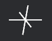

# bevy-cross-gizmo

Adds `cross` and `cross_2d` gizmos to Bevy.




## Installation

```toml
[dependencies]
bevy-cross-gizmo = "0.13.2"
```

## Usage

```rust
use bevy::prelude::*;
use bevy_cross_gizmo::BevyCrossGizmo;

fn update(mut gizmos: Gizmos) {
    gizmos.cross(Vec3::ZERO, 0.3, Color::WHITE);
    gizmos.cross_2d(Vec3::ZERO, 0.3, Color::WHITE);
}
```

## Compatibility

| `bevy` | `bevy-cross-gizmo` |
|--------|--------------------|
| 0.13.2 | 0.13.2             |

## License

Dual-licensed under either:

* MIT License (LICENSE-MIT or http://opensource.org/licenses/MIT)
* Apache License, Version 2.0 (LICENSE-APACHE or http://www.apache.org/licenses/LICENSE-2.0)

at your option.
